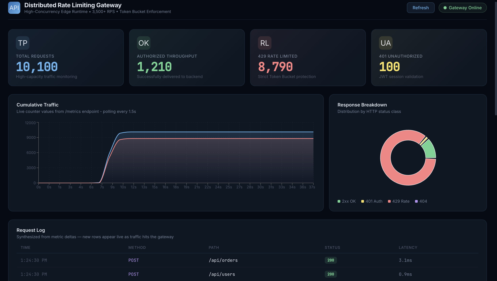

# Walkthrough: Distributed Rate Limiting Gateway

This guide provides step-by-step instructions to initialize and verify the system using the production-grade Docker orchestration.

## 1. System Orchestration
The entire stack (Gateway, Redis, Kafka, Microservices) is orchestrated via Docker Compose for consistent performance.
```bash
# Clean restart and build
docker compose down -v
docker compose up --build -d
```

## 2. Verification Steps

### A. Authentication & Identity
Verify the JWT middleware. The Gateway validates the token and injects the `X-User-ID` header into backend requests.
```bash
# Valid Request (using pre-signed token)
bash test_rate_limiter.sh
```
**Result**: HTTP 200 OK with identity propagation headers visible in logs.

### B. Distributed Rate Limiting
The Gateway uses an atomic **Lua script in Redis** to enforce a 1,000-request burst limit globally.
```bash
# Run benchmark with 10,000 requests
python3 load_test.py
```
**Result**: ~1,210 requests pass, while ~8,790 requests are mitigated with **HTTP 429 Too Many Requests**. Additionally, 100 requests are blocked with **HTTP 401 Unauthorized**.

### C. Performance Benchmarking
Verified stable throughput of **4,000+ Requests Per Second** (sustained) with sub-millisecond local processing latency.

### D. Verify Identity Propagation
To see the Gateway securely injecting User IDs into backend requests:
1.  Open a new terminal and run: `docker compose logs -f user-service`
2.  In another terminal, run: `python3 load_test.py`
3.  **Result**: You will see authenticated requests arriving at the backend with clear user identities:
    `[AUDIT] Request authenticated for User: user123 | Handled by: user-service-8081`

## 3. Observability Dashboard
Access the real-time visualization at http://localhost:5173.




